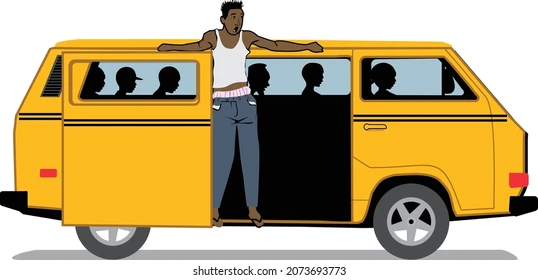
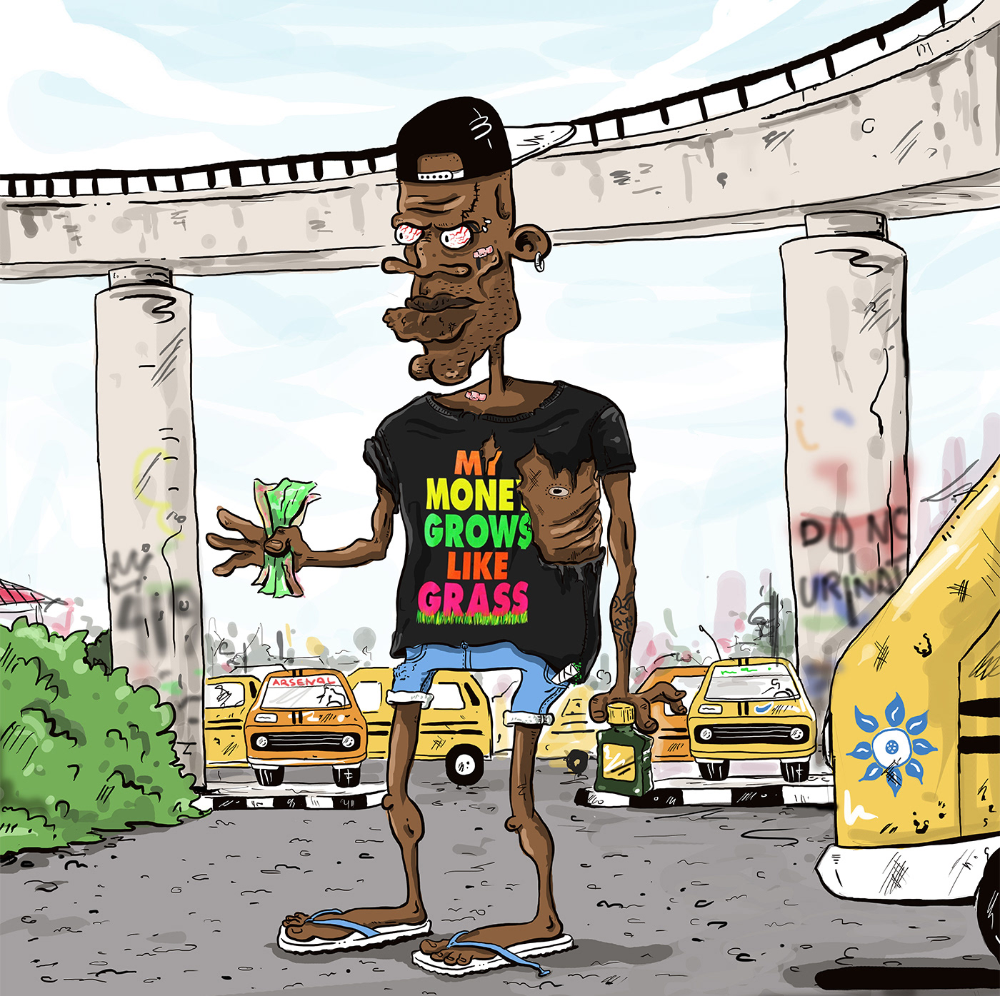
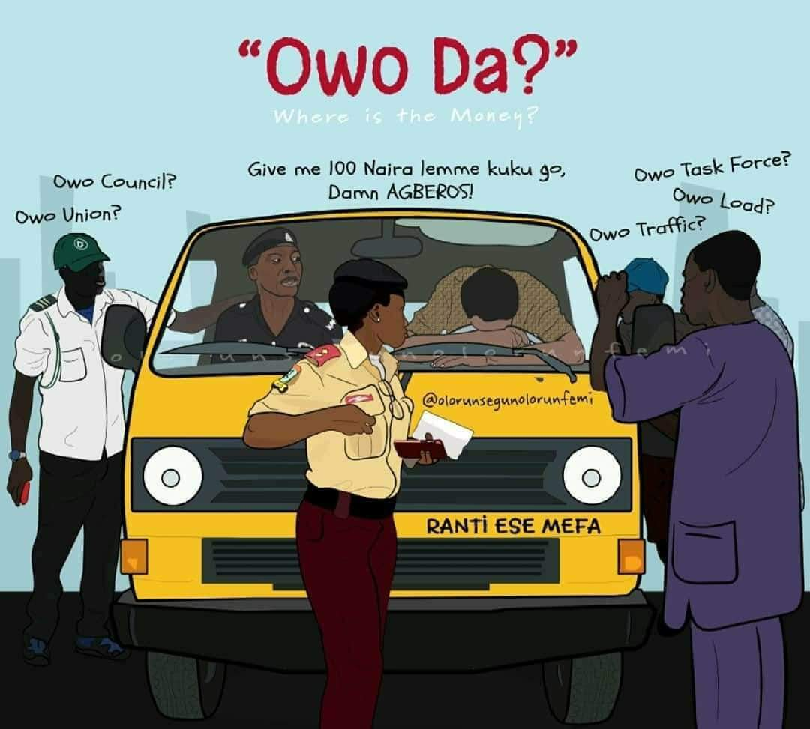

# Danfo-Wahala 😓😓😓

The old Volkswagen Vanagon bus, primarily used for commercial transportation in Lagos and painted in a distinct yellow 
color that gives it a unique identity, typifies the Lagos lifestyle with the hustle and rush of passengers, drivers, 
conductors, and other commuters. It is also a place where most passengers must put on their game-face to avoid being 
cheated.

These buses, colloquially called "Danfo," are usually operated by a driver who navigates the challenging Lagos traffic 
and a bus conductor who is responsible for announcing the bus's destinations at bus stops, collecting cash payments from
passengers, and managing relationships with passengers, street urchins (Agberos), and various law enforcement officials 
(LASTMA, VIO, Police, and FRSC). For example, Agberos are present at almost every bus stop along most routes, 
extorting money from conductors. The conductors, in turn, try to evade them, sometimes leading to fights that disrupt 
the entire bus journey for passengers. In addition, drivers are always on the lookout for law enforcement officials who 
may arrest them or impound the bus for minor traffic infractions.

There are fascinating language and conventions dynamics used by the drivers, bus conductors, passengers, and Agberos as 
they utilize the Danfo buses to achieve their respective objectives (KPIs) in terms of profit and transit.

Bus conductors strictly deal in cash, using Naira denominations that have street names:
 * faiba = ₦10
 * muri = ₦20
 * wazo = ₦50
 * figo = ₦500
 * one thousand = ₦1000

When a passenger does not have the exact cash amount or provides a denomination for which the bus conductor is unable to
“make change”, the passenger may be kicked off the bus, sometimes violently, or they may be "joined together" (tied) 
with other passengers to make up the total available denomination, which covers their "change", leaving them to sort 
themselves out – one that can lead to a fight between two passengers even after the bus has left.

The Volkswagen Vanagon bus is a remarkably resilient vehicle. However, no piece of machinery can withstand the brutal 
stress of Lagos transit without eventually breaking down. Additionally, to maximize profit, the driver and conductor 
often cut corners on fuel, oil, and water, providing just enough to get the bus to the next stop on its route. While 
they are skilled at this optimization, it does occasionally backfire. It is not uncommon for buses to experience 
breakdowns, leading to frustration and drawing the ire of passengers, and law enforcement.

Overall, it's an interesting transportation model peculiar to Lagos state, and it's been working for its inhabitants 
for decades.
